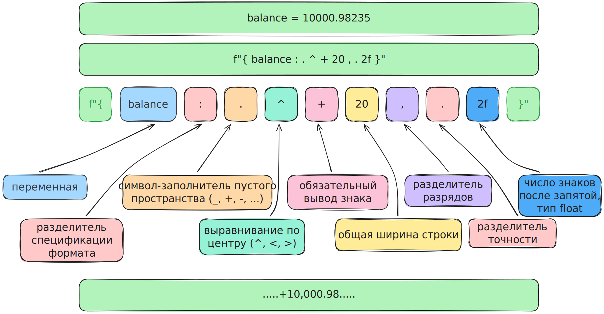

### Строки

Строка — это неизменяемая последовательность символов в одинарных или двойных кавычках. Неизменяемость означает, что все методы строк возвращают новую строку, а не вносят изменения в исходную

#### Форматирование

[Stepik Атомный курс про Python](https://stepik.org/lesson/2139476/step/1?unit=2170944){target="_blank"}

#### методы строк

- [Stepik Атомный курс про Python](https://stepik.org/lesson/2156736/step/1?unit=2188382){target="_blank"}

- [Stepik Атомный курс про Python](https://stepik.org/lesson/2162506/step/1?unit=2194190){target="_blank"}